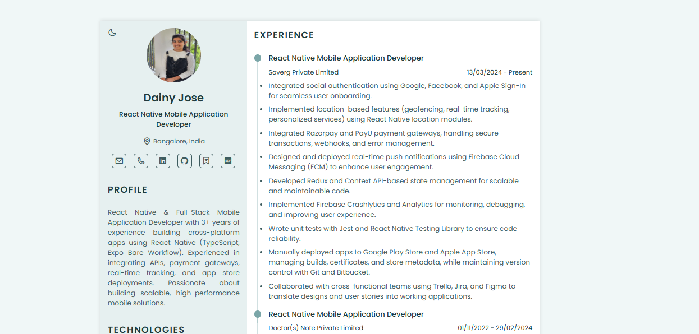

# Dainy Jose | Resume

---



<div align="center">

[](https://dainyjose.github.io/my-portfolio/)
[](https://www.linkedin.com/in/dainyjose/)
[](https://dev.to/dainy_jose)
[](https://github.com/dainyjose)

 </div>

---

## About

A modern, responsive, and interactive online resume built with **React** and **TypeScript**. This website showcases my profile, skills, experience, projects, hobbies, and development blogs, and includes a downloadable PDF resume feature.

---

## Features

- Fully responsive design for desktop, tablet, and mobile.
- Dark and light theme support.
- Interactive navigation menu with smooth scrolling.
- Sections included:
  - Profile
  - About Me
  - Skills (Technical & Soft Skills)
  - Experience
  - Academic & Projects
  - Development Blogs
  - Hobbies
  - Footer with social links
- Downloadable resume as PDF.
- Print-ready resume layout.

---

## Live Preview

Check it out: [https://dainyjose.github.io/my-resume/](https://dainyjose.github.io/my-resume/)

---

## Tech Stack

- **React** (Functional Components & Hooks)
- **TypeScript** for type safety
- **CSS Grid & Flexbox** for layout
- **Boxicons** for icons
- **React Router** for smooth section navigation

---

## Project Structure

```bash
src/
├── Components/
│ ├── AboutMe.tsx
│ ├── Academic.tsx
│ ├── DevBlogs.tsx
│ ├── Footer.tsx
│ ├── Hobbies.tsx
│ ├── Menu.tsx
│ ├── Profile.tsx
│ ├── Projects.tsx
│ ├── Skills.tsx
│ └── Works.tsx
├── data/
│ ├── Menu.ts
│ └── resumeData.ts
├── App.tsx
└── index.tsx
```

---

## Installation

1. Clone the repository:

```bash
git clone https://github.com/dainyjose/my-resume.git
cd my-resume
```

2. Install dependencies:

```bash
bun install
```

3. Start the development server:

```bash
bun run dev
```

---

## Usage

- Navigate sections using the menu or scroll.

- Click the Download Resume button in the footer to print or save the resume as PDF.

- Works on all modern browsers and mobile devices

---

## Customization

- Update your personal info in `src/data/resumeData.ts`.

- Update social links in `src/data/Menu.ts` and `resumeData.ts`.

- Replace images and icons as needed in the `Components` folder.

## 🧑‍💻 Author

**Dainy Jose**  
[GitHub](https://github.com/dainyjose) | [LinkedIn](https://linkedin.com/in/dainyjose)

---
